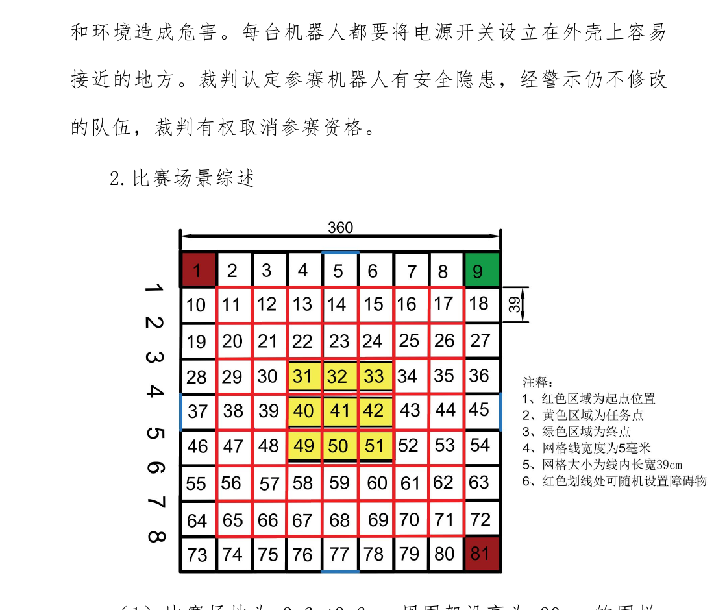
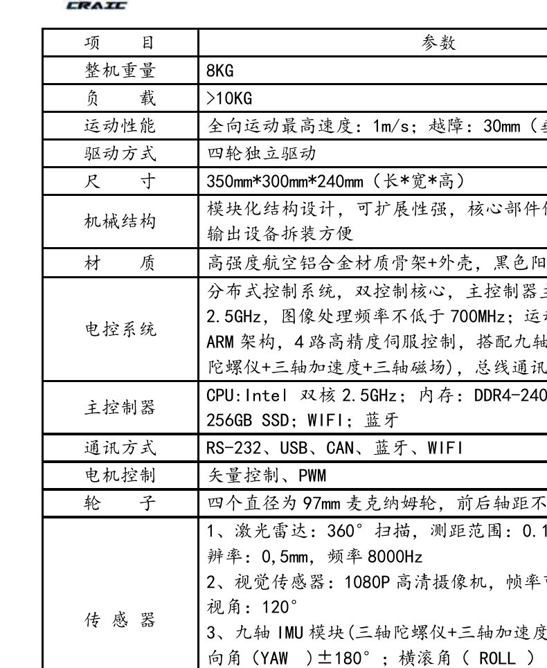

# 机器人任务挑战赛：自主巡航 / 地面巡航项目需求说明

> 本文件用于放入代码仓库，供 Claude Code / 代码助手理解项目目标、比赛规则、功能边界、验收标准和开发优先级。  
> 文件性质：项目需求说明 + 工程实现约束，不是最终参赛技术报告。  
> 来源：第二十八届中国机器人及人工智能大赛比赛规则（线上），“机器人任务挑战赛，自主巡航比赛规则”中的“场景一：地面巡航场景”。

---

## 0. 项目一句话目标

实现一套用于“地面巡航场景”的自主移动机器人系统：机器人从起点出发，通过语音唤醒开始比赛，自主识别场地中的任务信息图像，解析目标任务点，完成路径规划、避障、精准到点、语音播报，并最终进入终点区域。

工程闭环为：

```text
语音唤醒
  -> 启动比赛流程
  -> 自主巡航 / 搜索任务信息图像
  -> 视觉识别任务信息
  -> 解析目标任务点
  -> 导航到目标任务点
  -> 静止并语音播报
  -> 继续下一任务
  -> 导航到终点
  -> 静止并语音播报结束
```

---

## 1. 比赛场景与核心规则

### 1.1 场地尺寸

- 比赛场地：`3.6 m × 3.6 m`。
- 场地周围围栏高度：`30 cm`。
- 场地被划分为 `9 × 9` 网格，共 81 个格子。
- 单格理论尺寸：`3.6 m / 9 = 0.4 m`，即每格约 `40 cm × 40 cm`。
- 参赛队需要额外准备若干 `40 cm × 30 cm` 挡板。

### 1.2 场地图



图中含义：

| 图示元素 | 含义 |
|---|---|
| 1 号区域 | 起点区域之一 |
| 81 号区域 | 起点区域之一，也允许放置第二辆机器人辅助主机器人识别任务信息 |
| 9 号绿色区域 | 终点区域 |
| 31、32、33、40、41、42、49、50、51 | 9 个任务点所在区域 |
| 红色划线 | 可能随机摆放挡板的位置 |
| 围栏内侧蓝色标记位置 | 任务信息图像粘贴位置 |

> 实现要求：起点、终点、任务点、障碍物候选位置必须做成可配置项，不要把坐标直接硬编码在业务逻辑里。

### 1.3 任务点

比赛场地内设置 9 个任务点。任务点位于以下格子：

```text
31, 32, 33,
40, 41, 42,
49, 50, 51
```

每个任务点是 `38 cm × 32 cm` 的长方形，需要在对应黄色格子中居中规划。

注意：机器人尺寸要求为 `350 mm × 300 mm × 240 mm`，任务点尺寸仅为 `380 mm × 320 mm`。如果机器人实物接近规则上限，则进入任务点时的允许误差很小。系统不能只依赖“导航到点成功”事件，必须做精确到点判定。

建议实现：

- 维护任务点多边形区域或中心点 + 朝向 + 尺寸。
- 机器人到点后先停车，等待位姿稳定。
- 判断机器人 footprint 是否完全进入任务点区域。
- 播报期间保持静止，不允许边播报边移动。

### 1.4 任务信息图像

- 场地围栏内侧贴有 4 张任务信息图像。
- 图像中心距离地面高度：`20 cm`。
- 任务信息图像在比赛现场公布。
- 机器人需要识别任务信息图像，并根据图像内容确定对应任务点。

实现要求：

- 任务图像识别模块必须允许赛前/现场更换模板或模型。
- 任务图像与任务点的映射关系必须可配置。
- 不要假设任务图像内容固定不变。
- 识别结果必须带置信度、时间戳和图像来源。
- 低置信度识别结果不得直接驱动机器人去目标点，应进入重识别或确认流程。

---

## 2. 机器人平台约束

### 2.1 官方参数表



### 2.2 关键硬件要求

| 类别 | 规则要求 |
|---|---|
| 整机重量 | 8 kg |
| 负载 | > 10 kg |
| 运动性能 | 全向运动最高速度 1 m/s，越障 30 mm 垂直 |
| 驱动方式 | 四轮独立驱动 |
| 尺寸 | 350 mm × 300 mm × 240 mm |
| 机械结构 | 模块化结构，可扩展，核心部件保护性强，输入输出设备拆装方便 |
| 材质 | 高强度航空铝合金骨架 + 外壳，黑色阳极氧化处理 |
| 主控制器 | Intel 双核 2.5 GHz，DDR4 8 GB，256 GB SSD，Wi-Fi，蓝牙 |
| 通讯方式 | RS-232、USB、CAN、蓝牙、Wi-Fi |
| 电机控制 | 矢量控制、PWM |
| 轮子 | 4 个直径 97 mm 麦克纳姆轮，前后轴距不低于 24 cm |
| 传感器 | 激光雷达、1080P 摄像头、九轴 IMU、编码器 |
| 动力系统 | 12V 15Ah 动力锂电池组，续航不低于 3 小时 |
| 显示器 | 10.1 寸高清显示器 |

### 2.3 认证材料要求

若使用自制平台，需要准备并提交平台认证材料，包括但不限于：

- 机器人尺寸测量材料；
- 机器人测量视频；
- 机器人详细硬件介绍；
- 主控制器型号与参数；
- 执行控制器参数；
- 传感器参数；
- 电机参数；
- 轮距；
- 软件架构与方案；
- 硬件原理图。

---

## 3. 得分项与验收目标

### 3.1 官方计分项

| 序号 | 得分项 | 分值 |
|---:|---|---:|
| 1 | 语音唤醒并播报比赛开始 | 10 |
| 2 | 识别第一个任务信息并语音播报 | 10 |
| 3 | 识别第二个任务信息并语音播报 | 10 |
| 4 | 识别第三个任务信息并语音播报 | 10 |
| 5 | 识别第四个任务信息并语音播报 | 10 |
| 6 | 进入对应任务点并语音播报 | 10 |
| 7 | 进入对应任务点并语音播报 | 10 |
| 8 | 进入对应任务点并语音播报 | 10 |
| 9 | 进入对应任务点并语音播报 | 10 |
| 10 | 进入终点并语音播报 | 10 |
| 11 | 技术文档或答辩 | 10 |

总计可按 `110 分` 理解，其中现场任务链路 `100 分`，技术文档或答辩 `10 分`。

### 3.2 答辩 / 文档限制

- 答辩分不足 `3 分`：不参与一、二等奖评审。
- 答辩分不足 `6 分`：不参与一等奖评审。
- 技术文档重复率超过 `30%`：不参与一、二等奖评审。

实现要求：代码仓库中应保留清晰的工程文档、模块说明、启动说明、实验记录和关键参数说明，避免临近比赛时无法补技术报告。

---

## 4. 必须实现的功能模块

### 4.1 Mission Manager / 任务状态机

负责比赛流程控制。

建议状态机：

```text
IDLE
  -> WAIT_FOR_WAKEUP
  -> START_ANNOUNCE
  -> SEARCH_TASK_IMAGE_1
  -> RECOGNIZE_TASK_IMAGE_1
  -> NAVIGATE_TO_TASK_1
  -> ARRIVE_TASK_1
  -> ANNOUNCE_TASK_1
  -> SEARCH_TASK_IMAGE_2
  -> RECOGNIZE_TASK_IMAGE_2
  -> NAVIGATE_TO_TASK_2
  -> ARRIVE_TASK_2
  -> ANNOUNCE_TASK_2
  -> SEARCH_TASK_IMAGE_3
  -> RECOGNIZE_TASK_IMAGE_3
  -> NAVIGATE_TO_TASK_3
  -> ARRIVE_TASK_3
  -> ANNOUNCE_TASK_3
  -> SEARCH_TASK_IMAGE_4
  -> RECOGNIZE_TASK_IMAGE_4
  -> NAVIGATE_TO_TASK_4
  -> ARRIVE_TASK_4
  -> ANNOUNCE_TASK_4
  -> NAVIGATE_TO_FINISH
  -> ARRIVE_FINISH
  -> FINISH_ANNOUNCE
  -> DONE
```

异常状态：

```text
ABORT_COLLISION_RISK
ABORT_TIMEOUT
ABORT_LOCALIZATION_LOST
ABORT_PERCEPTION_FAILED
ABORT_NAVIGATION_FAILED
MANUAL_STOP_REQUESTED
```

要求：

- 状态跳转必须可日志追踪。
- 每次识别、导航、播报都要记录结果。
- 不能把各模块散落在脚本中硬串联，应有统一任务管理入口。

### 4.2 Navigation / 定位导航模块

职责：

- 建图或加载赛场地图；
- 定位机器人当前位姿；
- 根据任务点规划路径；
- 避开随机挡板；
- 精准进入任务点和终点；
- 避免触碰围挡。

要求：

- 支持 `3.6 m × 3.6 m` 小场地高精度导航。
- 支持麦克纳姆轮全向底盘控制。
- 支持动态障碍物或赛前随机障碍物检测。
- costmap / footprint 必须匹配真实机器人尺寸。
- 到点逻辑不能只看导航 action 是否成功，还要进行区域内判定。
- 机器人进入语音播报阶段必须完全停止。

建议：

- 将场地网格、任务点、起点、终点写入 `config/competition_field.yaml`。
- 将机器人尺寸、footprint、速度限制写入 `config/robot.yaml`。
- 将导航参数写入 `config/navigation.yaml`。

### 4.3 Perception / 任务图像识别模块

职责：

- 搜索围栏内侧任务信息图像；
- 识别图像内容；
- 输出对应任务点；
- 给出置信度；
- 在识别失败时触发重试或重新搜索。

输出数据结构建议：

```yaml
task_image_result:
  image_id: string
  target_cell: int
  confidence: float
  camera_frame: string
  timestamp: float
  raw_result: string
```

要求：

- 识别 4 个任务信息。
- 每个识别结果都必须可回放、可调试。
- 低置信度时不要直接导航。
- 支持赛前导入任务图像模板。
- 支持现场更新任务图像与任务点映射。

### 4.4 Voice I/O / 语音交互模块

职责：

- 语音唤醒比赛开始；
- 播报比赛开始；
- 播报任务信息识别结果；
- 播报到达任务点；
- 播报到达终点 / 比赛结束。

规则约束：

- 比赛开始和比赛结束必须有明确语音播报。
- 播报内容错误不得分。
- 机器人到达非目标点并语音播报不得分。
- 播报期间机器人必须静止，不得发生位移或动作。

实现要求：

- 播报接口需要返回“开始播报 / 播报完成 / 播报失败”。
- Mission Manager 只有在播报完成后才能进入下一状态。
- 播报文本集中配置，禁止散落在代码中。

### 4.5 Safety / 安全保护模块

职责：

- 防止碰撞围挡；
- 监控机器人是否长时间无状态变化；
- 监控定位是否丢失；
- 监控导航是否卡死；
- 提供急停或软件停止接口。

比赛结束相关风险：

- 机器人碰到围挡，比赛结束。
- 裁判宣布开始后 20 秒未开始运动，比赛结束。
- 运行过程中超过 20 秒状态无变化，裁判可宣布结束。
- 程序死机，裁判可宣布结束。

实现要求：

- 任务状态机需要有 watchdog。
- 每个关键模块需要 heartbeat。
- 导航卡死时应触发恢复策略，而不是无限等待。
- 日志中必须能看出机器人何时开始运动、何时停止、为何停止。

### 4.6 Logging / 回放与调试模块

至少记录：

- 状态机跳转；
- 语音唤醒事件；
- 播报文本与播报结果；
- 每次任务图像识别结果；
- 每次导航目标；
- 实际到点位姿；
- 是否进入任务点区域；
- 障碍物检测结果；
- 异常和恢复行为。

建议保存：

```text
logs/
  run_YYYYMMDD_HHMMSS/
    mission_log.jsonl
    perception_results.jsonl
    navigation_goals.jsonl
    voice_events.jsonl
    system_status.jsonl
    rosbag_or_video/
```

---

## 5. 建议配置文件

### 5.1 config/competition_field.yaml

```yaml
field:
  size_m: [3.6, 3.6]
  grid_rows: 9
  grid_cols: 9
  cell_size_m: 0.4
  fence_height_m: 0.30

cell_index_convention:
  description: "PDF 图中 1 在左上角，9 在右上角，73 在左下角，81 在右下角。具体 map 坐标转换由标定决定。"

start_cells: [1, 81]
finish_cell: 9

task_cells: [31, 32, 33, 40, 41, 42, 49, 50, 51]

task_region:
  size_m: [0.38, 0.32]
  centered_in_cell: true

obstacles:
  board_size_m: [0.40, 0.30]
  placement: "random_on_red_lines_in_rule_diagram"
  detection_required: true

task_images:
  count: 4
  center_height_m: 0.20
  placed_on_inner_fence: true
```

### 5.2 config/mission.yaml

```yaml
mission:
  max_time_s: 180
  required_task_image_count: 4
  require_start_voice: true
  require_finish_voice: true
  stop_before_voice: true
  voice_static_hold_s: 0.5
  localization_required: true
  retry_on_low_confidence: true

timeouts:
  no_motion_after_start_s: 20
  no_state_change_s: 20
  perception_retry_limit: 3
  navigation_retry_limit: 2
```

### 5.3 config/robot.yaml

```yaml
robot:
  drive_type: "mecanum"
  max_linear_speed_mps: 1.0
  size_m: [0.35, 0.30, 0.24]
  wheel_diameter_m: 0.097
  min_front_rear_wheelbase_m: 0.24

sensors:
  lidar:
    fov_deg: 360
    range_m: [0.15, 12.0]
  camera:
    resolution: "1080p"
    max_fps: 120
    fov_deg: 120
  imu:
    axes: 9
  encoder:
    lines_per_rev_after_multiplier: 3960
```

### 5.4 config/voice_text.yaml

```yaml
voice_text:
  start: "比赛开始"
  finish: "比赛结束"
  task_image_recognized_template: "已识别第 {index} 个任务信息，目标任务点为 {target_cell}"
  task_arrived_template: "已到达任务点 {target_cell}"
  finish_arrived: "已到达终点"
```

---

## 6. 代码仓库建议结构

下面是建议结构，Claude Code 应根据当前仓库实际语言、框架和 ROS/非 ROS 架构做最小侵入式调整：

```text
.
├── README.md
├── docs/
│   ├── PROJECT_REQUIREMENTS_GROUND_CRUISE.md
│   ├── architecture.md
│   ├── competition_notes.md
│   └── assets/
│       ├── craic_field_diagram_full.png
│       └── craic_robot_params_table.png
├── config/
│   ├── competition_field.yaml
│   ├── mission.yaml
│   ├── robot.yaml
│   ├── navigation.yaml
│   ├── perception.yaml
│   └── voice_text.yaml
├── src/
│   ├── mission_manager/
│   ├── navigation/
│   ├── perception/
│   ├── voice_io/
│   ├── safety/
│   └── common/
├── launch/
├── scripts/
├── tests/
└── logs/
```

如果当前项目是 ROS 2 项目，优先适配：

```text
ros2 launch <project> ground_cruise.launch.py
```

如果当前项目不是 ROS 2 项目，也应保留清晰的统一启动入口，例如：

```text
python scripts/run_ground_cruise.py --config config/mission.yaml
```

---

## 7. Claude Code 执行原则

后续让 Claude Code 修改仓库时，应遵守以下原则：

1. 先阅读仓库结构，再判断项目语言、构建系统和启动方式。
2. 不要直接大规模重构现有代码，优先做最小可验证修改。
3. 不要把比赛参数硬编码在业务逻辑中，所有比赛参数进入 `config/`。
4. 不要删除现有可运行功能，除非明确说明原因。
5. 每次修改后给出：修改文件、修改原因、如何运行、如何验证。
6. 能写单元测试就写单元测试；不能测试硬件行为时，至少提供仿真或 mock。
7. 所有关键状态必须有日志，方便赛前复盘。
8. 如果规则信息不足，不要猜测，应将不确定项写进 `TODO` 或配置占位。
9. 不要引入大型依赖，除非该依赖对导航、识别或语音是必要的。
10. 不要提交包含个人隐私、账号、密钥、内网地址的内容。

---

## 8. 最小可用版本 MVP

MVP 的目标不是一次拿满分，而是先跑通完整链路。

### 8.1 MVP 功能

必须跑通：

```text
启动程序
  -> 等待语音/键盘模拟唤醒
  -> 播报比赛开始
  -> 读取预置任务序列
  -> 导航到 1 个任务点
  -> 停车
  -> 播报到达任务点
  -> 导航到终点
  -> 停车
  -> 播报比赛结束
```

### 8.2 MVP 验收标准

- 能在模拟或实车环境中完成一次完整状态机流程。
- 能从配置文件读取起点、任务点、终点。
- 能记录状态机日志。
- 能保证播报时机器人停止。
- 能手动替换任务序列，不改源码。

---

## 9. 完整版本验收标准

### 9.1 功能验收

| 模块 | 验收标准 |
|---|---|
| 语音唤醒 | 能触发比赛开始流程，并播报开始 |
| 任务图像识别 | 能识别 4 个任务信息，并给出目标任务点 |
| 任务点导航 | 能依次进入 4 个目标任务点 |
| 终点导航 | 完成任务后进入终点区域 |
| 语音播报 | 每个关键节点播报正确，播报时机器人静止 |
| 避障 | 随机挡板摆放后仍能规划路径或触发恢复策略 |
| 安全 | 不碰围挡，不长时间卡死，无明显失控行为 |
| 日志 | 可以复盘每次识别、导航、播报和异常 |

### 9.2 比赛规则验收

- 比赛总时长控制在 `180 s` 内。
- 裁判开始后 `20 s` 内机器人必须开始运动。
- 机器人运行中不能超过 `20 s` 状态无变化。
- 机器人不能触碰围挡。
- 参赛人员不能进入场地。
- 到达任务点或终点必须有明确语音播报。
- 到达非目标点并播报不得分，系统必须避免错误播报。

### 9.3 工程验收

- 有统一启动入口。
- 有配置文件。
- 有日志系统。
- 有 README 使用说明。
- 有技术文档或报告草稿。
- 有测试或仿真验证方法。
- 有比赛参数快速修改入口。

---

## 10. 推荐开发里程碑

### M0：规则建模与仓库整理

- 增加本需求文件。
- 增加比赛场地配置。
- 增加任务状态机设计文档。
- 明确当前代码已有模块和缺失模块。

### M1：底盘与导航基础

- 跑通底盘控制。
- 配置机器人 footprint。
- 建立 3.6 m × 3.6 m 场地地图。
- 能导航到指定网格中心。

### M2：任务点精准到达

- 建立任务点区域判定。
- 实现到点停车和稳定检测。
- 验证 9 个任务点的到达精度。

### M3：任务图像识别

- 实现任务图像检测和识别。
- 实现图像结果到任务点编号的映射。
- 实现低置信度重试。

### M4：语音交互

- 实现语音唤醒或比赛启动触发。
- 实现统一播报接口。
- 保证播报期间机器人静止。

### M5：完整任务链路

- 连续识别 4 个任务信息。
- 依次完成 4 个目标点导航和播报。
- 最后进入终点并播报结束。

### M6：鲁棒性测试

- 随机挡板测试。
- 识别失败测试。
- 导航失败恢复测试。
- 定位丢失测试。
- 180 秒计时测试。

### M7：参赛文档与答辩准备

- 整理技术文档。
- 整理软件架构图。
- 整理硬件参数和认证材料。
- 整理实验记录和演示视频。

---

## 11. 当前不确定项

以下内容需要根据现场通知、队伍设备或后续规则确认：

1. 任务信息图像的具体格式。
2. 图像内容到任务点编号的映射方式。
3. 挡板具体随机摆放方式。
4. 是否允许使用特定语音识别/播报方案。
5. 线上比赛摄像头视角、录制和答辩细则。
6. 第二辆机器人辅助识别的具体协同判定标准。
7. 当前仓库实际运行环境、依赖、硬件接口和启动流程。

Claude Code 在遇到这些不确定项时，应优先使用配置项、TODO 和接口抽象，不要在代码中写死未经确认的假设。

---

## 12. 给 Claude Code 的首轮任务建议

可以直接让 Claude Code 执行：

```text
请阅读 docs/PROJECT_REQUIREMENTS_GROUND_CRUISE.md 和当前仓库结构，完成以下工作：

1. 判断当前仓库已有模块分别对应需求中的哪些模块。
2. 列出缺失模块和高风险模块。
3. 不要立刻大改代码，先生成一个实现计划。
4. 如果仓库中还没有配置系统，请先增加 config/competition_field.yaml、config/mission.yaml、config/robot.yaml、config/voice_text.yaml。
5. 如果仓库中还没有任务状态机，请设计 Mission Manager 的最小实现框架。
6. 每一步修改后说明改了哪些文件、为什么改、如何运行、如何验证。
```

---

## 13. 优先级总结

最高优先级：

1. 任务状态机；
2. 精准导航到点；
3. 任务图像识别；
4. 静止语音播报；
5. 安全避障与防碰围挡；
6. 日志和复盘；
7. 技术文档与答辩材料。

本项目的关键不是单个算法，而是系统级稳定性。比赛得分依赖完整链路：识别正确、导航正确、播报正确、动作时序正确、全程不碰围挡、3 分钟内完成。
